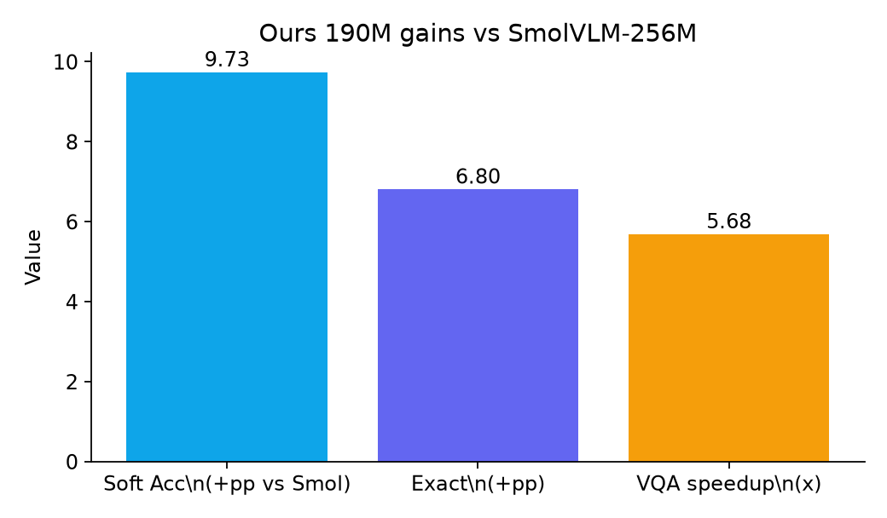
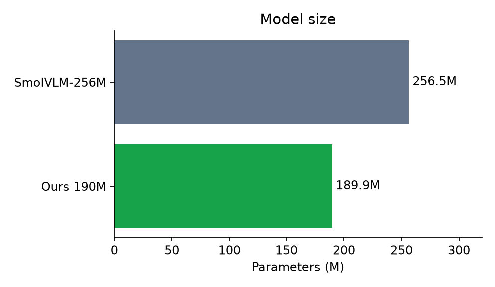
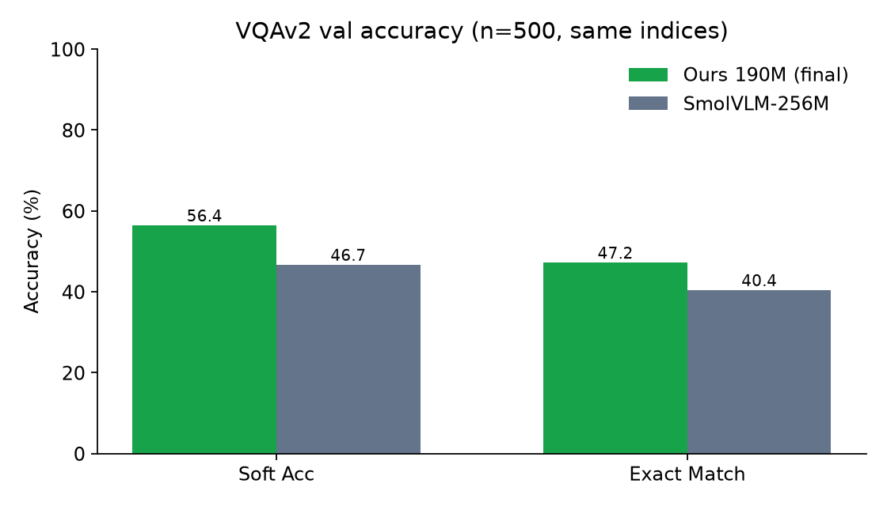
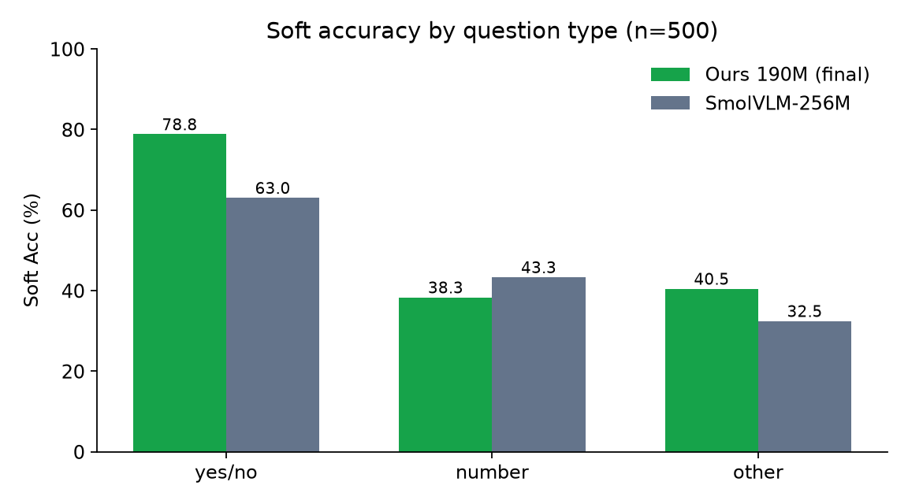
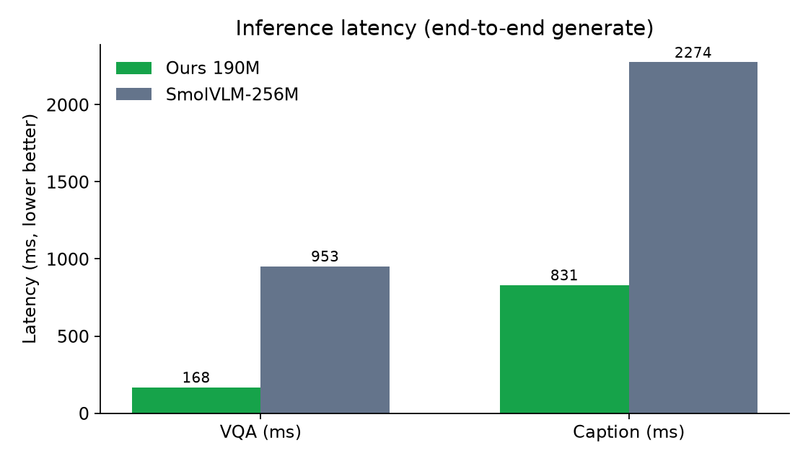
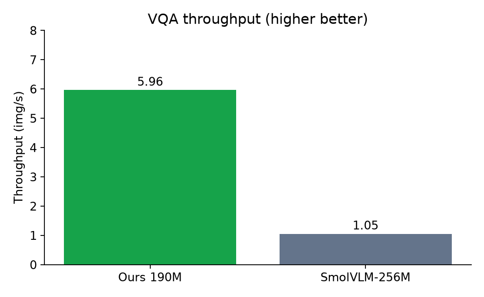

# TinyViT-21M Phase-2 Best（~190M）

训练混合任务：**VQAv2 + 图像描述 + 人脸属性**。  
本包为验证集 loss 最优 checkpoint（step ≈ **2122000**，val CE ≈ **1.213**）。

相对官方 **SmolVLM-256M**：在同集 VQAv2 子集上准确率更高，推理更快、参数更少。



| 对比项 | Ours ~190M | SmolVLM-256M | 相对 |
| --- | ---: | ---: | ---: |
| 总参数 | **189.9M** | 256.5M | −66.6M |
| VQAv2 Soft Acc (n=500) | **56.40%** | 46.67% | **+9.73 pp** |
| VQAv2 Exact (n=500) | **47.20%** | 40.40% | **+6.80 pp** |
| VQA 延迟 (mean) | **167.8 ms** | 952.8 ms | **约 5.7× 更快** |
| VQA 吞吐 | **5.96 img/s** | 1.05 img/s | **约 5.7×** |

---

## 1. 模型组成与参数



| 模块 | 参数量 |
| --- | ---: |
| TinyViT-21M 视觉 | 20.7M |
| PixelShuffle connector | 1.3M |
| Smol 文本塔（含 LoRA） | 139.5M |
| 　其中 LoRA | ≈4.9M |
| LM head | 28.4M |
| **合计** | **≈189.9M** |

- 视觉输入：512×512，约 **64** 个 visual tokens  
- Checkpoint 内容：本目录仅含 `connector.pt` + `lora/`（需配合仓库内 `weights/smol`、`weights/tinyvit`）

---

## 2. 准确率（vs SmolVLM-256M）

**协议**：VQAv2 validation **同一 500 条**；greedy；Ours 用训练格式短答；Smol 使用短答提示  
`Answer with a single word or short phrase.`



| 模型 | Soft Acc | Exact |
| --- | ---: | ---: |
| Ours best | 55.47% | 46.00% |
| **Ours final** (`step_2183905`) | **56.40%** | **47.20%** |
| SmolVLM-256M（短答） | 46.67% | 40.40% |

本包权重对应 **best**（val loss 最优）；上表 final 略高，整体同一量级。日常推理推荐用本包。

### 按题型 Soft Acc



| 题型 | Ours final | SmolVLM-256M | Δ |
| --- | ---: | ---: | ---: |
| yes/no (n=211) | **78.83%** | 63.03% | +15.8 pp |
| number (n=60) | 38.33% | **43.33%** | −5.0 pp |
| other (n=229) | **40.47%** | 32.46% | +8.0 pp |

更多样例与协议说明：仓库内 `checkpoints/phase2/COMPARE_SMOLVLM.md`。

---

## 3. 速度（vs SmolVLM-256M）

**协议**：CUDA 端到端 `generate`（含预处理）；合成 512×512 图；VQA `max_new_tokens=16`，Caption=48；n=30，warmup=3。  
测速时 GPU 上可能有其它任务，绝对毫秒会偏慢，**相对倍率**更有参考价值。





| 模型 | VQA mean | VQA median | VQA p90 | VQA 吞吐 | Caption mean |
| --- | ---: | ---: | ---: | ---: | ---: |
| **Ours 190M** | **167.8 ms** | 163.1 ms | 216.8 ms | **5.96 img/s** | **830.9 ms** |
| SmolVLM-256M | 952.8 ms | 929.0 ms | 1088.6 ms | 1.05 img/s | 2274.2 ms |

原始数据：`checkpoints/phase2/speed_compare.json`。

复现：

```bash
python scripts/bench_speed.py --n 30 --warmup 3 --out checkpoints/phase2/speed_compare.json
```

---

## 4. 目录内容

```
tinyvit21m_phase2_best/
  connector.pt
  lora/
    adapter_config.json
    adapter_model.safetensors
  META.json
  README.md                 # 本文件
  example_infer.py
  example_batch.py
  figs/                     # 准确率 / 速度图表
```

### 依赖（不在本包内）

| 依赖 | 路径 |
| --- | --- |
| Smol 基座 + tokenizer | `weights/smol/` |
| TinyViT-21M | `weights/tinyvit/` |
| 模型代码 | `models/` |
| 图像预处理 | `data/common.py` |

Python：`torch`、`transformers`、`peft`、`timm`、`Pillow`、`torchvision`、`safetensors`。

---

## 5. 使用示例

在仓库根目录 `d:\changing` 下：

```bash
# 看图描述
python packages/tinyvit21m_phase2_best/example_infer.py --image 你的图片.jpg

# 视觉问答
python packages/tinyvit21m_phase2_best/example_infer.py --image 你的图片.jpg --question "What color is the car?"

# 人脸外貌
python packages/tinyvit21m_phase2_best/example_infer.py --image face.jpg --question "Describe this person's appearance so they can be recognized."

# 批量描述
python packages/tinyvit21m_phase2_best/example_batch.py --image-dir path/to/images --out captions.txt
```

或：

```bash
python main.py demo --checkpoint packages/tinyvit21m_phase2_best --image 你的图片.jpg
python main.py demo --checkpoint packages/tinyvit21m_phase2_best --image 你的图片.jpg --question "How many people?"
```

### Python API

```python
from pathlib import Path
import sys

ROOT = Path(r"d:\changing")
sys.path.insert(0, str(ROOT))

from scripts.infer_utils import load_phase2_model, generate_answer

PKG = ROOT / "packages" / "tinyvit21m_phase2_best"
model, tok, device, ckpt = load_phase2_model(PKG)

print(generate_answer(model, tok, "photo.jpg", question=None))
print(generate_answer(model, tok, "photo.jpg", question="Is it daytime?"))
```

### 提示习惯

- 不传 question → `Describe the image.`（短英文描述）
- 传 question → 短答 VQA
- 图像 resize 到 512×512，ImageNet 归一化

---

## 6. 局限

1. VQA 准确率基于 **n=500** 子集，不是完整 VQAv2 val / 官方 test 提交。  
2. 与 SmolVLM 视觉骨干不同，属任务表现与速度对比，非同架构消融。  
3. 速度测于忙碌 GPU 时，空闲环境下绝对延迟通常更好。  
4. 本包不含合并后的单文件全量权重，推理需基座 + 本目录 adapter。

---

## 7. 相关文件

- 准确率报告：`checkpoints/phase2/COMPARE_SMOLVLM.md`、`compare_smolvlm_report.json`
- 速度报告：`checkpoints/phase2/speed_compare.json`
- 训练产出原路径：`checkpoints/phase2/best`
